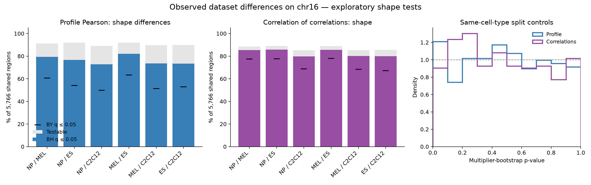

# Summary

Observed SMF data on validation chromosome **chr16** contain ample differential signal for evaluating whether the NP, MEL, ES, and C2C12 models learn cell-type dataset differences. Among **5,766 shared regions**, exploratory shape tests find **4,202–4,727 profile differences** and **4,594–4,940 correlation-pattern differences** per cell-type contrast at BH q ≤ 0.05. These correspond to approximately **82–89%** and **94–97%** of testable regions. No models were sampled or evaluated.

These are pooled-dataset differences, not identified biological effects: the user does not expect to recover replicate/batch identities or perform batch correction. The datasets were processed in the same lab around the same time with the same pipeline, which supports comparability but does not resolve confounding.

# Key Points

- Shape tests target patterns visible to profile Pearson and correlation-of-correlations, using centered unit vectors and statistic `2*(1-Pearson)`.
- Separate within-cell-type influence-function multiplier bootstraps preserve dependence among statistics from the same molecule. There are 1,999 draws per test, with correction across six contrasts separately for each metric.
- An initial pooled-read permutation screen was rejected as evidence for changed correlations: differing means alone triggered 30/30 synthetic correlation-pattern calls despite unchanged population correlations.
- Calibration remains exploratory: same-cell-type controls reject at nominal rates of 7.2% for profile shape and 5.1% for correlation shape, versus the intended 5%. Neither has BH discoveries. The direct, unnormalized difference tests reject at 4.9% for both metrics.
- Future model evaluation should select regions and score predictions on independent observed read subsets. The present counts use all reads and will change after splitting.

# Details

The following results, design, and limitations are copied from the completed analysis report, with command provenance and relative artifact links added for this notes repository.

## Results

| Cell types | Profile testable | Profile significant | CoC testable | CoC significant | Both significant |
|---|---:|---:|---:|---:|---:|
| NP-MEL | 5,254 | 4,575 | 5,095 | 4,917 | 4,358 |
| NP-ES | 5,300 | 4,421 | 5,136 | 4,940 | 4,204 |
| NP-C2C12 | 5,139 | 4,202 | 4,911 | 4,594 | 3,848 |
| MEL-ES | 5,302 | 4,727 | 5,123 | 4,928 | 4,458 |
| MEL-C2C12 | 5,165 | 4,242 | 4,923 | 4,620 | 3,895 |
| ES-C2C12 | 5,177 | 4,236 | 4,929 | 4,609 | 3,888 |

All comparisons start with the same 5,766 regions. Significant means BH q ≤ 0.05 across all 34,596 region–cell-type-pair tests, separately for each metric; untestable entries receive p=1 for correction.

**The headline tests target shape differences visible to profile Pearson and correlation-of-correlations.** Each vector is centered and normalized to unit length. The statistic is squared distance between these normalized vectors, exactly 2*(1-Pearson). Separate direct-difference tests also capture offset/scale differences; their counts are saved in direct_difference_summary.tsv.



## Calibration and sensitivity

- profile: 37/512 (7.2%) same-cell-type split controls have nominal p < 0.05; 0 survive BH correction. Four cell types × 150 random regions, split into disjoint molecule halves.
- profile: 5,325 distinct regions are BH-significant in at least one contrast; 19,136 region–contrast tests survive the more conservative Benjamini–Yekutieli correction for arbitrary dependence.
- coc: 23/453 (5.1%) same-cell-type split controls have nominal p < 0.05; 0 survive BH correction. Four cell types × 150 random regions, split into disjoint molecule halves.
- coc: 5,223 distinct regions are BH-significant in at least one contrast; 25,215 region–contrast tests survive the more conservative Benjamini–Yekutieli correction for arbitrary dependence.

The shape-profile test has mild nominal inflation (7.2% versus 5%) in the split controls, so these are exploratory counts, not a guarantee of exact 5% FDR. Shape-CoC controls reject at 5.1%. The direct-difference tests reject at 4.9% for both metrics; neither direct nor shape controls has a BH discovery. BY and q≤0.01 counts provide sensitivity summaries but do not repair miscalibrated marginal p-values.

## Design

- Input: combined GCH SMF HDF5 datasets referenced by NP, MEL, ES, and C2C12_fixed saved configs; validation chromosome chr16, mm10. Evaluate the central [512,1536) bp of each 2,048-bp region, matching the models’ 1,024-bp output window.
- Join exact shared region IDs and positions. Profiles require ≥30 calls per site in both groups and ≥10 sites. Pairwise analysis requires separation ≤500 bp, ≥50 jointly covering molecules in both groups, ≥5 calls of each state at each member of the pair in each group’s jointly covering molecules, and ≥10 eligible pairs. The profile-level coverage filter is also applied before building pairs.
- Shape null: the population vectors have the same centered normalized direction (Pearson=1). Profile vectors contain site means; CoC vectors contain pairwise-complete within-molecule Pearson correlations. Statistic: sum of squared differences of unit vectors. Direct-difference sensitivity analysis instead tests equality of unnormalized vectors.
- Estimate each vector’s influence function separately within each cell type. Generate independent standard-normal multipliers for each molecule, sharing a molecule’s multiplier across every site and pair it contributes to. The squared length of the difference of the two perturbed vectors gives the null reference. Thus shared-molecule dependence between site pairs is retained, while different mean accessibility, read coverage, and noise levels can be retained between cell types.
- For site means, influence contributions are valid*(call-mean)/coverage. For pairwise correlation rho=(p11-mx*my)/sqrt(vx*vy), use its derivatives with respect to mx, my, and p11, multiplied by pair-valid/joint-coverage. Apply sqrt(n/(n-1)) finite-count variance corrections. For shape, propagate each influence vector through centering and unit normalization: (center(psi)-u*(center(psi) dot u))/norm(center(theta)). See bootstrap.py for formulas.
- Use 1,999 multiplier draws, reproducible region/contrast seeds, and p=(1+number of null statistics ≥ observed)/(2,000). No zero p-values. This is an asymptotic plug-in bootstrap, not an exact finite-sample test. Coverage/minority-call thresholds and null controls support its exploratory use.
- Pairwise statistics were checked against the repository’s covariation.py and influence derivatives against finite differences. Input calls and positions are validated, including unique read IDs within each input region.

- The complete assay-mask audit checked all 5,766 regions in all four input files: zero sites in the evaluated window violate the current model’s DGCH mask. See assay_mask_check.json and check_assay.py.

## Why the initial permutation screen is not the headline result

The initial screen shuffled whole reads within identical coverage masks and tested low cross-dataset Pearson agreement. It tests equality of full conditional read distributions. In a synthetic check with identical population correlation matrices but different mean accessibility, it rejected 30/30 cases for correlation-of-correlations. Pooling groups with different means changes the reference correlation structure. Same-cell-type controls alone do not reveal this failure mode.

The revised direct-difference bootstrap rejected 7/100 cases in that synthetic check at nominal 5%; the shape bootstrap rejected 8/100. Both detected profile changes in 100/100. The direct test also detected a changed dependence structure. The permutation artifacts are retained for transparency, but their counts are not interpreted as discoveries of changed pairwise correlations.

## Interpretation and limitations

- These are pooled-dataset differences. Biological and batch effects remain inseparable. Pairwise Pearson changes can themselves be driven partly by changed marginal accessibility; a significant change is not an isolated mechanistic dependence effect.
- Significant does not imply a large effect. summary.tsv includes median absolute RMS differences among shape discoveries, estimated sampling-noise RMS, and descriptive profile Pearson / correlation-of-correlations. Raw shape-run RMS columns are in normalized-vector units, not accessibility units.
- All observed reads are used for this discovery screen. Future model evaluation should select regions on one read subset and score predictions on independent reads; counts will generally change after splitting.
- Data-dependent coverage/minority-call eligibility and approximate influence-function inference warrant sensitivity checks before confirmatory use. Same-cell-type controls assess read-sampling calibration, not biological replication.
- Overlapping regions/site pairs are dependent. Molecule multipliers retain within-region dependence; BY counts supplement BH for dependence between region-level tests. A 0.0005 p-value floor limits stringent discoveries. Each metric and shape/direct variant is a separate testing family.

## Reproduction and artifacts

Run from `/home/users/diamant/repos/SMFNet` with `load_smf` active (environment details below):

```bash
python analyses/differential_chr16_20261005/bootstrap.py --workers 2 --output "$SCRATCH/differential_chr16_20261005/bootstrap_full"
python analyses/differential_chr16_20261005/bootstrap.py --workers 2 --limit 150 --controls --output "$SCRATCH/differential_chr16_20261005/bootstrap_controls"
python analyses/differential_chr16_20261005/bootstrap.py --workers 6 --shape --output "$SCRATCH/differential_chr16_20261005/shape_full"
python analyses/differential_chr16_20261005/bootstrap.py --workers 1 --limit 150 --controls --shape --output "$SCRATCH/differential_chr16_20261005/shape_controls"
python analyses/differential_chr16_20261005/summarize_bootstrap.py
```

Headline per-region outputs and metadata: `/scratch/users/diamant/differential_chr16_20261005/shape_full/`. Shape controls: `/scratch/users/diamant/differential_chr16_20261005/shape_controls/`. Direct tests: `/scratch/users/diamant/differential_chr16_20261005/bootstrap_full/` and `/scratch/users/diamant/differential_chr16_20261005/bootstrap_controls/`. Initial permutation screen: `/scratch/users/diamant/differential_chr16_20261005/full/` and `/scratch/users/diamant/differential_chr16_20261005/controls/`. Scratch artifacts are reproducible and temporary; this directory retains the code, report, compact summaries, and figures.

The full-distribution null of label permutation is described in the [SciPy permutation-test documentation](https://docs.scipy.org/doc/scipy/reference/generated/scipy.stats.permutation_test.html).

## Environment, execution, and recovery provenance

Executed on Sherlock node `sh04-03n07.int` inside existing Slurm allocation `46630540` (partition `btrippe`, 8 CPUs, 125 GiB memory, one allocated GPU). No new Slurm jobs were submitted. The GPU was busy/unavailable, so the completed analyses ran on CPUs.

Working checkout: `/home/users/diamant/repos/SMFNet`, branch `nd/more_assays`, HEAD `1151cbb3bb69d55231d765416457a2806a87f700` at note creation. The exploratory directory was untracked; the script snapshots linked below preserve its implementation independently of that checkout.

Environment setup used the existing shell function (not an alias):

```bash
cd /home/users/diamant/repos/SMFNet
load_smf
```

At execution, `load_smf` loaded `uv/0.10.8`, activated Conda environment `smf_net`, set `UV_PROJECT_ENVIRONMENT="$GROUP_HOME/uv-envs/SMFNet-cu124"`, `UV_CACHE_DIR="$GROUP_HOME/uv-cache"`, and `HDF5_DIR="$CONDA_PREFIX"`, then sourced `$GROUP_HOME/uv-envs/SMFNet-cu124/bin/activate`. PyTorch was `2.5.1+cu124`; NumPy was `2.5.2`. Python commands were launched through `bash -ic 'load_smf; ...'` in the interactive tool.

The initial GPU pilot failed with `CUDA-capable device(s) is/are busy or unavailable`; the CPU rerun succeeded. The diagnostic permutation runs were:

```bash
python analyses/differential_chr16_20261005/investigate.py --limit 25 --permutations 199 --output "$SCRATCH/differential_chr16_20261005/pilot"
python analyses/differential_chr16_20261005/investigate.py --device cpu --limit 25 --permutations 199 --output "$SCRATCH/differential_chr16_20261005/pilot_cpu"
python analyses/differential_chr16_20261005/investigate.py --device cpu --workers 6 --limit 100 --permutations 1999 --output "$SCRATCH/differential_chr16_20261005/pilot_1999"
python analyses/differential_chr16_20261005/investigate.py --device cpu --workers 6 --limit 150 --permutations 1999 --controls --output "$SCRATCH/differential_chr16_20261005/controls"
python analyses/differential_chr16_20261005/investigate.py --device cpu --workers 6 --permutations 1999 --output "$SCRATCH/differential_chr16_20261005/full" > "$SCRATCH/differential_chr16_20261005/full.log" 2>&1
python analyses/differential_chr16_20261005/check_synthetic.py
python analyses/differential_chr16_20261005/check_assay.py
```

The direct and shape full runs above also redirected output to `$SCRATCH/differential_chr16_20261005/bootstrap_full.log` and `shape_full.log`, respectively. The synthetic-check script initially failed only while serializing a NumPy integer to JSON; its rejection-count sum was cast to Python `int`, and `python analyses/differential_chr16_20261005/check_synthetic.py` was rerun successfully. This did not alter the statistical results. The final script snapshot contains that fix.

# Related Notes

- [Train-set positional baselines and noise-matched correlation-of-correlations](../2026-09-29/positional-covariation-baselines-and-noise-matched-corr-of-corr.md): Explains why correlation-of-correlations depends strongly on read-sampling noise and why independent pseudo-replicates are useful for future model comparisons.
- [Flank baseline for profile metrics](flank-baseline-logistic-regression.md): Documents GCH sequence-context and strand effects that can contribute to profile agreement and should inform baseline choices in a differential model benchmark.

# Open Questions

- How many discoveries remain after splitting observed molecules into independent selection and evaluation sets?
- Can profile-shape calibration be improved beyond the observed 7.2% nominal rejection rate, especially for low-signal regions?
- How well do model-predicted differences match independent observed differences, relative to simple cell-type/context baselines?
- Which significant effects are large and reproducible enough to prioritize, rather than merely detectable at high coverage?

# Sources

- [Original analysis report snapshot](chr16-differential-effects/README.md): Copied from `/home/users/diamant/repos/SMFNet/analyses/differential_chr16_20261005/README.md`.
- [Compact summary](chr16-differential-effects/summary.tsv), [detailed shape results](chr16-differential-effects/detailed_summary.tsv), and [direct-difference results](chr16-differential-effects/direct_difference_summary.tsv).
- [Shape controls](chr16-differential-effects/controls_summary.tsv), [direct controls](chr16-differential-effects/direct_difference_controls.tsv), [synthetic checks](chr16-differential-effects/synthetic_checks.json), and [complete assay-mask audit](chr16-differential-effects/assay_mask_check.json).
- [Input paths and method metadata](chr16-differential-effects/metadata.json): Records all four combined HDF5 datasets and thresholds. Model-config roots were `$SCRATCH/smf_models/{NP,MEL,ES,C2C12_fixed}/`; checkpoints were not used.
- Durable script snapshots: [bootstrap.py](chr16-differential-effects/bootstrap.py), [initial permutation screen](chr16-differential-effects/investigate.py), [synthetic validation](chr16-differential-effects/check_synthetic.py), [assay audit](chr16-differential-effects/check_assay.py), and [report generation](chr16-differential-effects/summarize_bootstrap.py). Scripts assume the original SMFNet checkout/environment and input locations; restore them to its `analyses/differential_chr16_20261005/` directory if needed.
- [Figure PDF](chr16-differential-effects/results.pdf) and [figure PNG](chr16-differential-effects/results.png).
- Repository implementation inspected: `/home/users/diamant/repos/SMFNet/src/smf_net/evaluation/covariation.py`, `src/smf_net/data.py`, and `scripts/sample.py`.
- [SciPy permutation-test documentation](https://docs.scipy.org/doc/scipy/reference/generated/scipy.stats.permutation_test.html): Describes the full-distribution null used by the initial screen.
- User discussion and completed commands on 2026-10-05; this note adds no new analysis.
